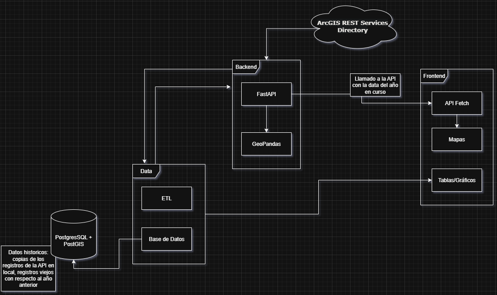

# Desired System:

## ON DEVELOPMENT: 

- New approach:
    - Access both services using nginx reverse-proxy by just building and running the services from docker compose, then using your browser, access to: [http://localhost](http://localhost). 
    With this approach, you can access both services using just one short URL

# FullStack Web App – ArcGIS API geodata Integration & Visualization

Web Data visualization about criminal activity and cop presence in Bogota,
using official geodata from ArcGIS API service.

## Technologies

- Python 3.14
    - pip, venv, uv
- Vite
    - Native Javascript
- Docker
    - docker compose
- Reverse Proxy
    - nginx

## Stack

Ensure both services are running, this in order to enable RESTful communication between them

### Backend

- FastAPI
- GeoPandas
- Requests / httpx

### Frontend

- Vite (Vanilla JS)
- Folium
- Bootstrap CDN
- Chart.JS CDN

#### How to run:

- At the root directory of the project, execute:
    - `docker compose up --build`
- Using your browser, access to: [http://localhost](http://localhost)
- Can change network configs inside [docker-compose](docker-compose.yaml), and [nginx](./nginx/nginx.conf) files
